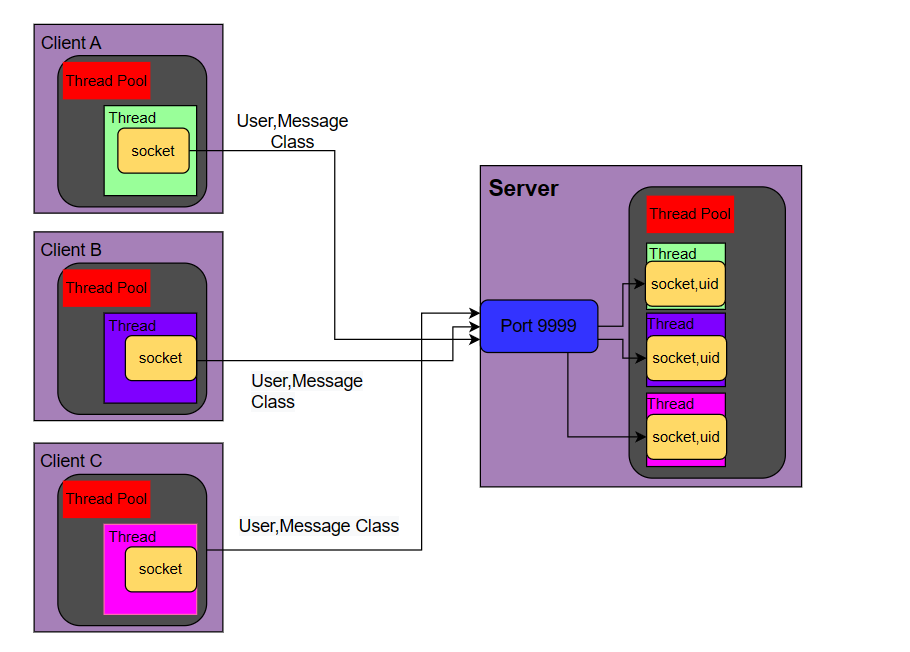

# Mini Chat Box
***Author:Dennis***


## Overview
* This project aims to implement a multi-client plain text chat server that can accept connections from multiple clients at the same time and forward the text sent by any client to all clients (including senders) by using JAVA.


## API
* This project calls the `readString()` method of the Ulitity class, which is used to handle various user inputs.

```java
    /**
     * Function: Read a string of specified length entered by the keyboard
     * @param limit: The length of the limit
     * @return: A string of specified length
     */

    public static String readString(int limit) {
        return readKeyBoard(limit, false);
    }
```

* Please note that as I chose the local device to act as a server for this project,so I chose to call  `InetAddress.getLocalHost()` method to get the server's IP address when creating the client's socket object.

```java
 socket=new Socket(InetAddress.getLocalHost(),9999);
```

>In this project,you can call `InetAddress.getByName()` to get the IP address of the given hostname instead of calling`InetAddress.getLocalHost()`.

## How to use
* You can use `java -jar .\sth.jar` to run the `.jar file` of the client and sever on your terminal.
  >The location of the two `.jar file` 
  >* \chat_room_Client\out\artifacts\chat_room_jar
  >* \chat_room_Server\out\artifacts\char_room_Server_jar

* As this project doesn't implement authentication, you can connect directly to the server and communicate with other  clients when you enter your username on the client you are running.
  


##  Code analysis



>This is the sketch of the whole project .We can see each client and server has a thread pool to manage the threads that hold the socket and then use ***User and Message Class*** to communicate between the client and server.

***The following is the analysis of main codes that implement this feature.***

### Common Class

* Message.java
  
```java  
  public class Message implements Serializable {
    private static final long serialVersionUID=1L;
    private String content;
    private String sender;
    private String mesType;

    public String getMesType() {
        return mesType;
    }

    public void setMesType(String mesType) {
        this.mesType = mesType;
    }

    public String getContent() {
        return content;
    }

    public void setContent(String content) {
        this.content = content;
    }

    public String getSender() {
        return sender;
    }

    public void setSender(String sender) {
        this.sender = sender;
    }
}
```

>As the sketch showing above ,we can see the ***Message Class*** implements ***Serializable*** interface to make it can be serialized and deserialized.So that we can send the message between client and server.

* User.java
```java
public class User implements Serializable {
    private String uid;
    private static final long serialVersionUID=1L;

    public User(){}

    public User(String uid) {
        this.uid = uid;
    }

    public String getUid() {
        return uid;
    }

    public void setUid(String uid) {
        this.uid = uid;
    }
}
```
>The ***User Class*** is used to store the user information and implements ***Serializable*** which intension is same with the ***Message Class***.

### Client

* UserClientService.java
```java
public class UserClientService {

    private User u=new User();
    private Socket socket;

    public void commuteWithServer(String uid){

        u.setUid(uid);

        try {
            socket=new Socket(InetAddress.getLocalHost(),9999);

            ObjectOutputStream oos = new ObjectOutputStream(socket.getOutputStream());
            oos.writeObject(u);

            ObjectInputStream ois = new ObjectInputStream(socket.getInputStream());
            Message ms = (Message)ois.readObject();

            if(ms.getMesType().equals(MessageType.MESSAGE_LOGIN_SUCCEED)){
                ClientConnectServerThread c_cst = new ClientConnectServerThread(socket);
                c_cst.start();
                ClientThreadPool.addClientConnectServerThread(uid,c_cst);


            }

        } catch (Exception e) {
            e.printStackTrace();
        }
    }
}   
```
>The ***UserClientService Class*** establishes a connection with a server, sends user information, and receives a response from the server. If the login is successful, it creates a new thread for communication with the server.

* MessageClientService.java
  
```java
public class MessageClientService {

    public void sendMessageToAll(String content,String senderId){
        Message message=new Message();
        message.setSender(senderId);
        message.setContent(content);


        try {
            ObjectOutputStream oos = new ObjectOutputStream(ClientThreadPool.getThread(senderId).getSocket().getOutputStream());
            oos.writeObject(message);
        } catch (IOException e) {
            e.printStackTrace();
        }
    }
}
```
>The ***MessageClientService Class*** creates a Message object with the provided content and sender ID, and sends it to all connected clients.

* ClientConnectServerThread.java
```java
public class ClientConnectServerThread extends Thread{
    private Socket socket;

    public ClientConnectServerThread(Socket socket){
        this.socket=socket;
    }

    public Socket getSocket() {
        return socket;
    }

    @Override
    public void run() {
        while(true){

            try {

                ObjectInputStream ois = new ObjectInputStream(socket.getInputStream());
                Message ms = (Message)ois.readObject();
                System.out.println(ms.getSender()+" to everyone:"+ms.getContent());
            } catch (Exception e) {
                try {
                    System.out.println("Server Exception");

                    socket.close();
                    System.exit(1);

                } catch (IOException ioException) {
                    ioException.printStackTrace();
                }

            }
        }
    }
}
```
>The ***ClientConnectServerThread Class*** establishes a connection with the server, listens for incoming messages, and prints them to the console.

* ClientThreadPool.java
```java
public class ClientThreadPool {
    private static HashMap<String, ClientConnectServerThread> hm=new HashMap<>();

    public static void addClientConnectServerThread(String uid,ClientConnectServerThread c_cst){
        hm.put(uid,c_cst);
    }

    public static ClientConnectServerThread getThread(String uid){
        return hm.get(uid);
    }
}
```
>The ***ClientThreadPool Class*** maintains a HashMap to store and retrieve instances of the ClientConnectServerThread class, allowing efficient management of client connections.

### Server

* Chat_Server.java
```java
public class Chat_Server {
    private ServerSocket ss=null;

    public static void main(String[] args) {
        new Chat_Server();
    }

    public Chat_Server(){

        try {
            System.out.println("Server listens on port 9999");
            ss=new ServerSocket(9999);
            while(true){
                Socket socket=ss.accept();

                ObjectInputStream ois =
                        new ObjectInputStream(socket.getInputStream());
                ObjectOutputStream oos=
                        new ObjectOutputStream(socket.getOutputStream());
                chatroom.common.User ur =(chatroom.common.User)ois.readObject();
                Message ms=new Message();
                ms.setMesType(MessageType.MESSAGE_LOGIN_SUCCEED);
                oos.writeObject(ms);
                ServerThread serverThread =
                        new ServerThread(socket, ur.getUid());
                serverThread.start();
                ServerThreadPool.addServerThread(ur.getUid(),serverThread);

            }
        } catch (Exception e) {
            e.printStackTrace();
        } finally {
            try {
                ss.close();
            } catch (IOException e) {
                e.printStackTrace();
            }
        }
    }
}
```
>The ***Chat_Server Class*** listens for incoming client connections, accepts them, and creates a new ServerThread for each client to handle communication.

* ServerThread.java
```java
public class ServerThread extends Thread{
    private Socket socket;
    private String uid;

    public ServerThread(Socket socket, String uid) {
        this.socket = socket;
        this.uid = uid;
    }

    public Socket getSocket() {
        return socket;
    }

    @Override
    public void run() {

        while(true){
            try {
                System.out.println("Server is in connect with user"+uid);
                ObjectInputStream ois = new ObjectInputStream(socket.getInputStream());
                Message ms =(Message) ois.readObject();

                HashMap<String,ServerThread>hm= ServerThreadPool.getHm();
                Iterator<String> iterator=hm.keySet().iterator();
                while(iterator.hasNext()){
                    String uid=iterator.next().toString();
                    if(!uid.equals(ms.getSender())){
                        ObjectOutputStream oos=
                                new ObjectOutputStream(hm.get(uid).getSocket().getOutputStream());
                        oos.writeObject(ms);
                    }
                }

            } catch (Exception e) {
                try {
                    System.out.println("user"+uid+" exit");
                    ServerThreadPool.removeServerThread(uid);
                    socket.close();
                    break;
                } catch (IOException ioException) {
                    ioException.printStackTrace();
                }

            }
        }
    }
}
```
>The ***ServerThread Class*** handles communication with a specific client by continuously receiving messages from the client and forwarding them to other connected clients.

* ServerThreadPool.java
```java
public class ServerThreadPool {
    private static HashMap<String, ServerThread> hm =new HashMap<>();

    public static HashMap<String, ServerThread> getHm(){
        return hm;
    }
    public static void addServerThread(String uid, ServerThread st){
        hm.put(uid,st);
    }

    public static void removeServerThread(String uid){
        hm.remove(uid);
    }
    public static ServerThread getServerThread(String uid){
        return hm.get(uid);
    }
}
```
>The ***ServerThreadPool Class*** uses a HashMap to store and retrieve instances of the ServerThread class, allowing efficient management of server threads.


  ## Additon

  * The idea of this project is from ***B站 韩顺平***.
